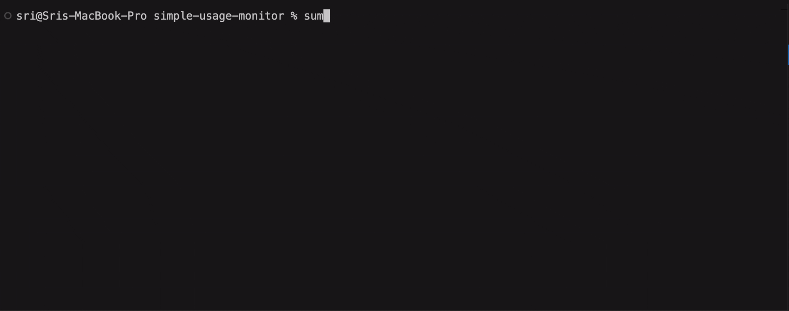

# simple-usage-monitor

[](https://pypi.org/project/sumonitor/)
[](https://github.com/SrivathsanSivakumar/simple-usage-monitor/blob/main/LICENSE)
[](https://codecov.io/gh/SrivathsanSivakumar/simple-usage-monitor)

[](http://makeapullrequest.com)

## In-terminal (HUD) usage monitoring for Claude Code - see your costs without leaving your workflow

Unlike other monitoring tools that require opening separate dashboards or browsers, **sumonitor displays your usage data right in your terminal in real-time** as you work. No context switching.



- Live token counts (input, output, cache)
- Cost tracking with tiered pricing
- Session limits based on your plan
- Time until session reset

All processing happens locally on your device - your sessions remain completely private.

### Supported Models
1. **Opus 4.6**
2. **Sonnet 4.6**
3. Opus 4.5
4. Sonnet 4.5
5. Haiku 4.5

Other models will still have accurate token counting, just not dollar cost.

## Installation

### Install from PyPI (Recommended)
`pip install sumonitor`

### Install from source
1. Clone the repo

    `git clone https://github.com/SrivathsanSivakumar/simple-usage-monitor`

2. Then install the tool
    `cd path/to/simple-usage-monitor`
 
    `pip install .`

### Uninstallation
`pip uninstall sumonitor`

### Troubleshooting

**PATH not found:** If you see `WARNING: The script sumonitor is installed in '/home/username/.local/bin' which is not on PATH`, add to your shell config:
```bash
export PATH="$HOME/.local/bin:$PATH"
```

**externally-managed-environment error:** On modern Linux (Ubuntu 23.04+, Debian 12+, Fedora 38+), use one of these alternatives:

- **pipx** (recommended):
  ```bash
  pipx install sumonitor
  ```

- **Virtual environment**:
  ```bash
  python3 -m venv myenv && source myenv/bin/activate
  pip install sumonitor
  ```

## Usage

Simply run:

```bash
sumonitor
```

This will:
1. Auto-detect your Claude Code installation
2. Start Claude Code with the monitoring overlay
3. Show real-time usage at the bottom of your terminal

### Command Line Options

```bash
sumonitor [OPTIONS]
```

**Options:**

- `--plan {pro,max5,max20}` - Your Claude subscription plan (default: `pro`)
  - `pro`: Claude Pro plan limits
  - `max5`: Max 5 plan limits
  - `max20`: Max 20 plan limits

- `--path PATH` - Custom path to Claude Code binary (default: auto-detect)

- `--version` - Show version information

- `-h, --help` - Show help message

## Contributing

Contributions are welcome! Please see [CONTRIBUTING.md](CONTRIBUTING.md) for guidelines.

**Areas for contribution:**
- Support for additional Claude models
- Enhanced error handling
- Additional export formats for usage data
- UI improvements
- Overlay functionality improvements

## Changelog

See [CHANGELOG.md](CHANGELOG.md) for version history and release notes.

## Acknowledgments
Big thanks to [Claude Code Usage Monitor](https://github.com/Maciek-roboblog/Claude-Code-Usage-Monitor) for the inspiration and awesome work!
